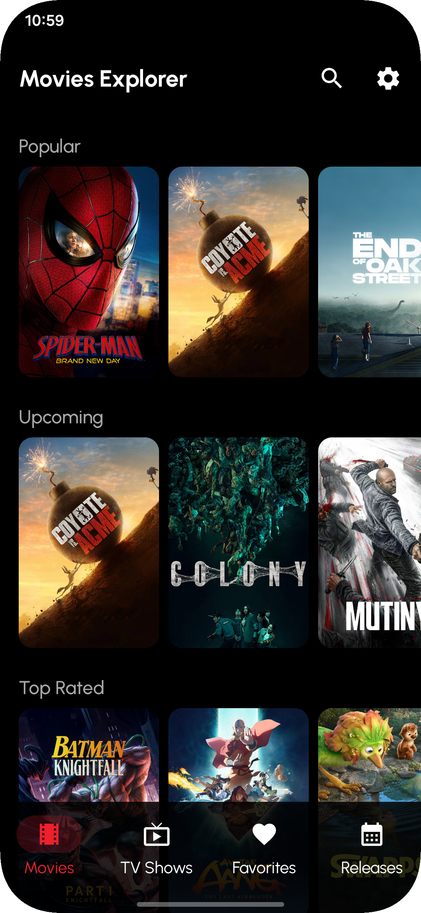
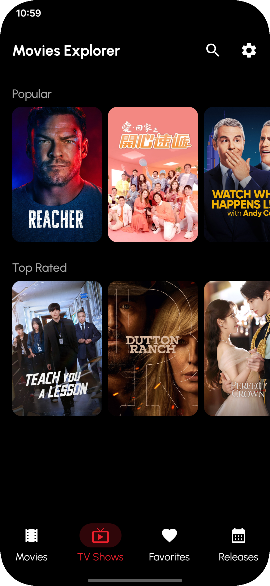

# Movies Compose 🎬

**Movies Compose** is a modern Android application that allows you to explore movies and TV shows using the [TMDB API](https://www.themoviedb.org/). The project was developed with a focus on current technologies, following the best practices for Android development.

---

## 📸 Screenshots

<div>
  
  
  
</div>

---

## 🏗️ Architecture

The project uses the **MVVM (Model-View-ViewModel)** architecture combined with **Clean Architecture** principles, ensuring a clear separation of concerns, ease of maintenance, and testability.

- **Data**: Implementation of repositories, data sources (Remote and Local), and mapping of data models (DTOs).
- **Domain**: Business rules, domain models, and Use Cases.
- **Presentation**: Declarative UI with Jetpack Compose, ViewModels for state management, and UI State.
- **Core**: Shared components, utilities, and base classes for other layers.

---

## 🛠️ Technologies and Dependencies

### Core
- **Kotlin**: Modern and concise programming language.
- **Coroutines & Flow**: Asynchronous programming and reactive data streams.
- **Hilt (Dagger)**: Dependency injection for Android.

### UI & UX
- **Jetpack Compose**: Modern toolkit for building native UI.
- **Material 3**: Google's design system for modern interfaces.
- **Navigation 3**: Type-safe and decoupled navigation between screens.
- **Coil**: Efficient image loading optimized for Compose.
- **Splash Screen API**: Native support for splash screens.

### Data & Networking
- **Retrofit & OkHttp**: REST API consumption and HTTP request management.
- **Room**: Local database (SQLite) with robust abstraction.
- **Paging 3**: Efficient data pagination from both API and local database.
- **DataStore**: Secure and reactive preference storage.
- **Kotlinx Serialization & Gson**: JSON data serialization.

### Utilities
- **Timber**: Extensible logging for Android.

---

## 🧪 Testing
The project has a solid testing foundation to ensure code quality:
- **Unit Tests**: JUnit 4, Kotest, MockK, Mockito, and Truth.
- **Integration Tests**: Robolectric for testing Android framework on the JVM.
- **UI Tests**: Espresso and Compose UI Test.

---

## 📝 Commit Patterns

The project adopts the **Conventional Commits** standard in conjunction with **Gitmojis** to maintain a readable and organized change history.

### Commit Types:
- `✨ feat`: Introduction of new features.
- `♻️ refactor`: Code changes that neither fix bugs nor add features.
- `✅ test`: Adding or correcting tests.
- `🔧 chore`: Maintenance tasks, build configurations, etc.
- `📦 build`: Changes affecting the build system or external dependencies.
- `📝 docs`: Documentation changes.

### Example:
`✨ feat(search): implement debounced movie search`

---

## 🚀 How to Run

1. Clone the repository.
2. Obtain an API key from [TMDB](https://www.themoviedb.org/documentation/api).
3. Create an `apiKey.properties` file in the root directory with the following keys:
   ```properties
   API_KEY=YOUR_API_KEY_HERE
   BASE_URL=https://api.themoviedb.org/3/
   BASE_URL_IMAGE=https://image.tmdb.org/t/p/
   ```
4. Sync Gradle and run the application.

---

Developed by [Bruno Félix](https://github.com/brunofelix) 🚀
